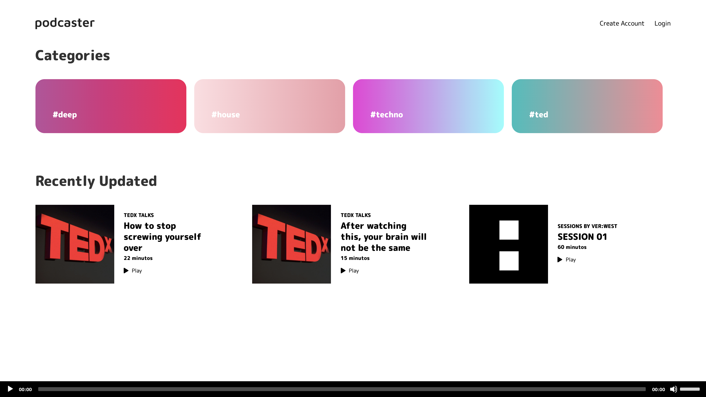
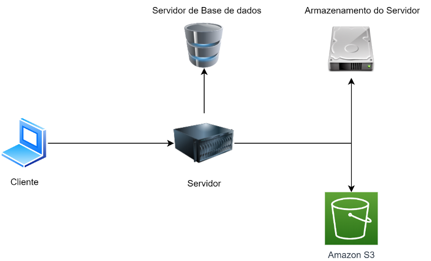
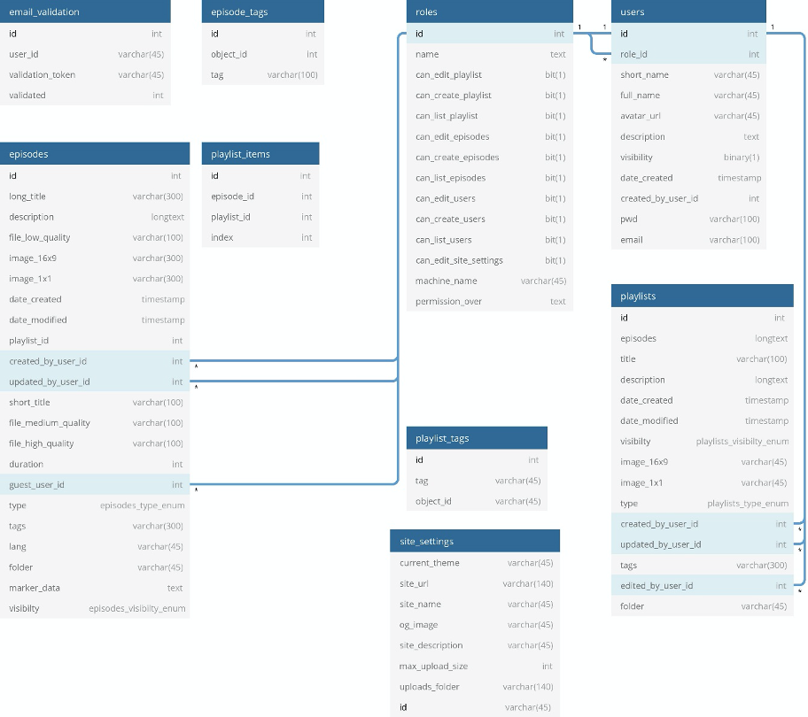

# Podcaster

Hi all. 

Podcaster was a project that was developed during the summer semester of 19/20 for a class called [SMI](https://sigq.isel.pt/en/subjects/multimedia-systems-for-the-internet-leim). The subject of this class is about architecture of websites, and the final project was develping a CMS that would allow the users to host / edit content. The theme for this CMS was music, and what i proposed was to develop a CMS to host podcasts. This uses composer as a package manager.

None of this works now, because i just ended up shutting down the S3 account. Might have it hosted so you people can try it out.

## Requirements
Like all college projects, you are always given a set of requirements that you must follow. It was as follows
- Use PHP, since this was part of class programme
- Use a database, preferably MariaDB
- Use an external service, either developed by the student with Servlets, or any third-party one
- Users, with a permissions system
- Backoffice for editing, add or remove content
- Front-office to display the content

_(There are a couple of more that i can't remember now, but every requirement had a percentage of the final project grade)_

## Development
So, keeping this short, the images were stored on the server disk while the audio is sent to an Amazon S3 bucket. The key of the file was then stored within the databse, so that the front-office
The emails were sent using a pre-configured Gmail account, with the PHPMailer Lib. The front-office is rendered with blade templates, and there is minimal javascript on this project

I have a detailed text on how this is working together, as part of the final written report for the project. It's in portuguese if you care to read, and it's the `detail.pdf` file. For that report, i had to do a couple of diagrams.

#### Other used libs:
- klein router
- bladeOne

### Why not [insert framework here]
Because i had no time. I did try laravel, but has time was running out, i just went full panic mode, and did everything with raw php.

### Infrastructure (really simple diagram, sorry it's in portuguese)

### Database strucutre 

